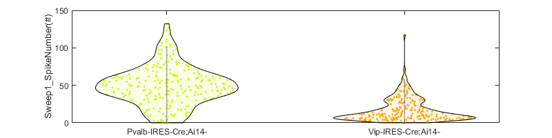

[](https://creativecommons.org/licenses/by/4.0/) 
   


In this repository is the code to reproduce Figure 4-6 in the following manuscript:

>**Ma, X.**, Miraucourt, L., Qiu, H., Xu, M., Sharif, R., & Khadra, A. (2023). ElecFeX: A user-friendly toolkit for efficient feature extraction from single-cell electrophysiological recordings. bioRxiv, 2023-05.

This code can also work with the excel outputs from [ElecFeX](https://github.com/XinyueMa-neuro/ElecFeX) to perform:

1. [Electrical property's value visualization](#1-electrical-propertys-value-visualization) <br>
   &ensp; 1.1 [Histogram plot](#11-histogram-plot) <br>
   &ensp; 1.2 [Violin plot](#12-violin-plot) <br>
2. [Dimentional reduction by PCA](#2-dimentional-reduction-by-pca) <br>
3. [k-means cluster](#3-k-means-cluster) <br>
  &ensp; 3.1 [Optimal cluster number](#31-optimal-cluster-number)  <br>
  &ensp; 3.2 [Perform and visualize the k-means cluster](#32-perform-and-visualize-the-k-means-cluster)  <br>
  &ensp; 3.3 [Compare clusters to their known identities](#33-compare-clusters-to-their-known-identities)  <br>

Here, an example data file `20230723_210859_X4PS_SupraThresh_DA_0.xlsx` in the `code` folder is from the dataset Gouwen et al., 2020 ([link](https://dandiarchive.org/dandiset/000020/)). The information on this dataset, e.g., mouseline, is in the metafile `2021-09-13_mouse_file_ephys.xlsx` ([link](https://portal.brain-map.org/explore/classes/multimodal-characterization/multimodal-characterization-mouse-visual-cortex)).


The code was tested in MATLAB R2022a (time-stamp: 2024-Feb-10).

  

If you find the code helpful to your project, please cite it using this BibTeX entry:

```bibtex
@misc{ElecFeX,
  title = {ElecFeX-MaEtAl2024},
  author = {Xinyue Ma},
  note = {https://github.com/XinyueMa-neuro/ElecFeX-MaEtAl2024},
  year = {2024},
}
```


---
# 1. Electrical property’s value visualization

:point_right: `demo_visualization.m`.

This section is to visualize the values of a single electrical property in the form of [histogram](#11-histogram-plot) and [violin plot](#12-violin-plot). 

Specify the `dataFolder` and `excelfn` and load the excel file in Matlab. In the excel file outputed from ElecFeX, row names (or the column names) is the full path of data files. The full path, however,  may exceed the maximal length of row/col name of the "table" data type in Matlab and not be fully read. Therefore, `tb_header` load the full path specifically. In the example excel file, the row names are features and the column names are data file full path.

```Matlab
dataFolder = '';
excelfn = '20230723_210859_X4PS_SupraThresh_DA_0.xlsx'; % an example data in the code folder

tb = readtable([dataFolder,excelfn],"ReadRowNames",true,'Sheet','Sheet1','ReadVariableNames',true); 
tb_header = readtable([dataFolder,excelfn],"ReadRowNames",true,'Sheet','Sheet1','ReadVariableNames',false,'Range','1:1'); 
```

You can also load the identities of your datafiles if available. For instance, according to the metafile `2021-09-13_mouse_file_ephys.xlsx`, we loaded the data files from two reporter mouselines 'Pvalb-IRES-Cre;Ai14-' (number: 260) and 'Vip-IRES-Cre;Ai14-' (number: 225).

```Matlab
%% The identity of each data file (if any)
% meta file 
DataInfo_File = [dataFolder, '2021-09-13_mouse_file_ephys.xlsx'];
tb_info = readtable(DataInfo_File, "ReadRowNames", false); 

% get data file name
NWBfn = extractAfter(tb_header{1,:}, 'NWB_analysis\');
idx = cellfun(@(x)find(ismember(tb_info.file_name, x) ), NWBfn, 'UniformOutput',false);
NWBidx = [idx{:}];
NWBdonor = tb_info.donor_name(NWBidx);

% select mouselines
typelist = {'Pvalb-IRES-Cre;Ai14-', 'Vip-IRES-Cre;Ai14-'}; % ,'Sst-IRES-Cre;Ai14-'
NWBtype = zeros([1 length(NWBdonor)]);
for ii = 1:length(typelist)
     NWBtype( cellfun(@(x)startsWith(x, typelist{ii}), NWBdonor) ) = ii;
     fprintf('%s: cell number %d\n',typelist{ii}, sum(NWBtype==ii))
end

```

Otherwise, you can simply run:
```Matlab
typelist = {'unknown'};
NWBtype = ones([1 height(tb)]);
```

Pick a electrical property from the table and visualize their values by type (if known). Here, the spike number from 1st sweep is displayed.
```Matlab
%% get a electrical property's value from the excel output
ii = 1;
y = table2array(tb(ii,:)); % feature values
yname = tb.Properties.RowNames{ii}; % feature names
```

## 1.1 Histogram plot
```Matlab
colorrgb = {
    [0.1922    0.3686    0.1490;  0.2039         0    0.0078], ... % dark green, dark orange
    [0.7961    0.9765    0.0078;  1.0000    0.6471         0], ... % light green, light orange 
    };

figure('Position',[0,0,800,200])
for ii = 1:length(typelist)
    hAxis = subplot(1, length(typelist), ii);
    histogram(y(NWBtype == ii),'FaceColor',colorrgb{2}(ii,:),'EdgeColor',colorrgb{1}(ii,:),'LineWidth',1,...
                'Normalization','probability', 'BinEdges',linspace( min(y), max(y), 20) ); 
    box off; 
    ylim([0,0.5]); 
    yticks([0,0.5]); 
    title(typelist{ii})
    xlabel(yname,'Interpreter','none'); 
    ylabel('%');   
end
```


<div align=center></div>


## 1.2 Violin plot
The function `violinplot` is adopted from https://github.com/bastibe/Violinplot-Matlab
```Matlab
figure('Position',[0,0,800,200])
violinplot(y(NWBtype~=0), NWBtype(NWBtype~=0), 'ViolinColor',colorrgb{2}(1:2,:),...
           'MarkerSize',5,'EdgeColor',[0,0,0],'ShowMedian',false,'ShowMean',false,'Showbox',false,'ViolinAlpha',{0.1 0.1});
xticklabels(typelist); 
ylabel(yname,'Interpreter','none')
```
<div align=center></div>


# 2. Dimentional reduction by PCA

:point_right: `demo_pca.m`.

Before performing the cluster, the dimensionality of the electrical features is reduced by performing principle component analysis (PCA). This step is especially necessary when (1) the number of features are close to or even larger than the number of observations, and (2) the features are not independent to each other. 

In the code `demo_PCA.m`, PCA is performed separately on the features describing (1) spike train properties, (2) action potential (AP) voltage values, (3) AP slopes, and (4) AP durations. The alternating least squares (ALS) algorithm is used because there are many missing values (NaN) in the data. The first few principle components (PCs) whose cummulative explained variance exceeds 80% (see figure below) are kept (soid color in the inset bar plots) for the cluster step.

<div align=center></div>


# 3. K-means cluster
This section uses the PCs from the previous step to perform k-means cluster.

## 3.1 Optimal cluster number

:point_right: `demo_clustnum.m`.

To determine the optimal number of k-means clusters, there are several criteria, see [Matlab document: evalclusters()](https://www.mathworks.com/help/stats/evalclusters.html#shared-criterion). Different [distance matrix](https://www.mathworks.com/help/stats/kmeans.html#buefs04-Distance) and [cluster initiation methods](https://www.mathworks.com/help/stats/kmeans.html#buefs04-Start) may also lead to different cluster results. 

In the `demo_clusternum.m` code, for each distance matrix and cluster initiation method, k-means cluster is iteratively performed for 20 times. and evaluete the cluster using different criteria. Below is an example evaluation of k-means cluster by the Davies Bouldin criterion. The solid line is the mean value and the gray shaded region is the standard error of mean (SEM). The optimal cluster number is when the Davies Bouldin reaches minimum (marked by red pentagons).

You can play around the different criteria and the k-means cluster  settings.

<div align=center></div>


## 3.2 Perform and visualize the k-means cluster

:point_right: `demo_kmeans.m`.

The function `getCluster()` is using the same method as mentioned above to find the optimal cluster number, or you can specify the optimal cluster number by specify the parameter input 'NClustBest'. The result is visualized: the left panel is the k-means cluster result; the right panel is to highlight the observations from one of your known identities (black squares). The example below performed k-means cluster using the 'cosine' distance matrix, the "plus" cluster initiation method, and the optimal cluster number of 2.

```Matlab
[idxClust, NClustBest] = getCluster(mytable_PCA_zscore, 'kDistance',clt_dis,'kMaxIter',5000,'kMaxN',20,'kMinN',2,'kIterN',50,...
    'RandSeed',4,'kStart',startM,'IfDispAllSil',1,'IfDispBestSil',1,'NClustBest',NClustBest,'kCriterion',kCrite); %
```


<div align=center></div>

<div align=center></div>


## 3.3 Compare clusters to their known identities

:point_right: `demo_overlap.m`.

If you have information on the identities of the observation (e.g., the reporter lines of the recordings), you can quantify how the cluster results overlap to the known identities of the observations. The putative identity of the cluster is first determined when their Jaccard similarity ($\frac{A \\& B}{A|B}$) is maximal.

The overlap between the cluster and the known identity is then quantified by the true positive (TP), false positive (FP), true negative (TN), and false negative (FN), based on which we can get the sensitivity ($\frac{TP}{TP+FN}\\%$), specificity ($\frac{TN}{TN+FP}\\%$), and precision rate ($\frac{TP}{TP+FP}\\%$) of the cluster result.

<div align=center></div>

```Matlab
```
---
<p>
Author: Xinyue Ma <br>
Email: xinyue.ma@mail.mcgill.ca <br>
Integrated Program in Neuroscience <br>
McGill University <br>
Montreal, QC, H3A 1A1 <br> 
Canada <br>
</p>

----

## License

<a rel="license" href="http://creativecommons.org/licenses/by/4.0/"></a><br />This work is licensed under a <a rel="license" href="http://creativecommons.org/licenses/by/4.0/">Creative Commons Attribution 4.0 International License</a>.
